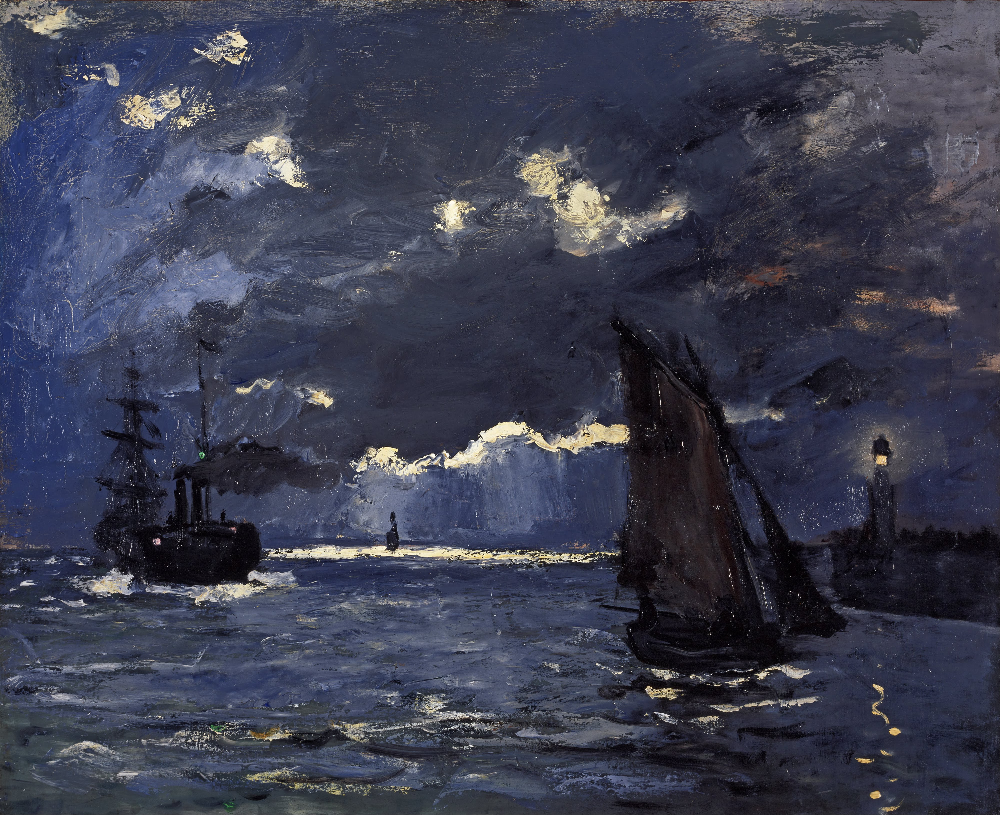

# Moonlight Drift🌝
### An Interactive Reinterpretation of *A Seascape, Shipping by Moonlight* by Claude Monet

Below is a team pitch for the IDEA9103 Creative Coding Final Project. Monet’s atmospheric nocturnal seascape is transformed into a living, breathing digital environment driven by sound, time, generative motion, and audience interaction.

---

## Part 1: Inspiration⛵️

The outcome will reinterpret an existing artwork.

**Artwork**: *A Seascape, Shipping by Moonlight* (c. 1864) by **Claude Monet**

*Claude Monet, A Seascape, Shipping by Moonlight, c. 1864. National Galleries of Scotland.*

### Vision

The artwork is heavily inspired by A Seascape, Shipping by Moonlight by Claude Monet, the existing artwork selected for reinterpretation in this project. Rather than directly recreating the painting, the project transforms it into a living atmospheric environment using p5.js. The project explores how sound, movement, time, and interaction can influence the emotional condition of the seascape. Inspired by generative ocean simulations, cinematic fog systems, and atmospheric visual effects commonly found in interactive storytelling, the design focuses on immersion and environmental transformation.

Instead of presenting the artwork as a single frozen moment, the experience continuously evolves through interaction, environmental shifts, and atmospheric transitions. Through the transformation of the painting into a living system, the project aims to create a more emotional, immersive, and experiential interpretation of Monet’s original work.

---

## Part 2: Mechanics and Presentation🛠️

| Team Member | Mechanic |
|---|---|
| **Mingtao Qu** | Time-based |
| **Larry Hao** | Audio |
| **Yiming Wang** | Perlin Noise + Randomness |
| **Jiale Bi** | User Input |

---

### ⏱️ Time-based — Mingtao Qu

My mechanic mainly focuses on the changing sky and lighthouse through a time-based system. The original artwork presents a dramatic nighttime seascape. I want to reinterpret this originally static painting as a dynamic environment that continuously changes over time. By creating a time cycle in p5.js, the sky will transition through different stages of the day, including dawn, daytime, sunset, and nighttime. At the same time, the clouds, sun, moon, and stars in the sky will gradually change throughout the cycle, creating different visual atmospheres and scene variations.

The lighthouse will also respond to the passage of time. During the daytime, the lighthouse light will appear faint or remain inactive. As the environment gradually shifts into nighttime, the lighthouse will begin glowing and flashing rhythmically, simulating realistic harbour lighting effects. This mechanic allows "time" itself to become part of the visual storytelling. Rather than simply recreating a single frozen moment from the original painting, our project transforms it into a living and continuously evolving scene.

---

### 🎵 Audio — Larry Hao

The Audio Mechanic introduces a sound-reactive storm ocean that transforms the painting from a calm seascape into a dynamic and responsive environment. Using live microphone input, voice, clapping, and surrounding sounds are translated into environmental changes rather than traditional audio visualisations. As sound levels increase, waves become larger and more energetic, foam becomes more visible, rainfall intensifies, and occasional lightning appears across the sky. When sound levels decrease, the storm gradually settles, allowing the ocean to return towards a calmer state through smooth transitions that preserve the atmosphere of the artwork.

The mechanic creates a sense of participation by allowing human presence to influence the landscape in real time. Rather than directly controlling an object, sound becomes a force that shapes the behaviour and mood of the environment. Quiet moments create a calmer and more reflective atmosphere, while louder sounds generate a more dramatic and expressive storm. This contrast between calm and turbulence transforms the ocean from a static visual element into a living component of the artwork, encouraging exploration and creating a stronger connection between the audience and the painting.

---

### 🌊 Perlin Noise + Randomness — Yiming Wang

Perlin Noise is used to create natural and smooth flowing movements for the sea and clouds in this artwork. It generates soft, organic changes that make the waves gently rise, fall, ripple, and churn in a realistic way, giving the water a lively and restless feeling. At the same time, the dark storm clouds slowly drift, swirl, and change shape across the sky. This helps bring the original painting to life. The classic artwork shows a dramatic stormy sea and heavy clouds. With Perlin Noise, the water and sky are no longer static — they move continuously and feel alive. Meanwhile, as the boat moves when clicked, the sea surface creates ripples and waves trailing behind it, giving users more visual feedback in response to their input.

This direct interaction makes the audience feel connected to the sea, as if their actions can stir nature’s energy. Together with the ever‑moving clouds and churning waves driven by Perlin Noise, the artwork transforms from a static painting into a living, breathing digital world. Viewers not only witness the power of the ocean but also leave their own trace upon it, deepening their sense of presence and the passage of time.

---

### 🖱️ User Input — Jiale Bi

The User Input mechanic lets the audience directly drive the scene with the mouse and keyboard. Clicking and dragging the sun or moon scrubs the time-of-day cycle forwards or backwards, so the viewer can control sunrise, noon, sunset and night by hand. Clicking and dragging the boat lets the audience reposition it across the sea. A hover highlight shows which element is interactive. Pressing SPACE pauses the entire sketch and R resets the scene. This mechanic 
connects to our vision of "unfreezing" Monet's painting—instead of watching time pass on its own, the audience physically takes hold of the sun, moon and boat, becoming the author of each moment in the seascape.

---

## Part 3: Putting It Together👍

All four mechanics share a single canvas representing Monet’s seascape, layered from background to foreground: the time-based sky and lighthouse in the background, the Perlin-driven sea and clouds in the middle ground, the audio-driven waves and fog modulating motion throughout the environment, and the user-input ripples in the foreground. These mechanics actively influence one another—audio intensity amplifies Perlin wave motion, user-generated ripples temporarily disturb the water surface, and the time cycle affects every layer, from the sky and sea to the lighthouse glow.

The project is unified through a single concept: **Monet’s painting is no longer frozen—it lives, breathes, and responds to interaction.**

---

## Part 4: AI Acknowledgement

**Jiale Bi (User Input):** 

I used Claude (AI) to help plan the overall structure of my mechanic and to review my code for errors. 

All of the code was written and implemented by me.

**Larry Hao (Audio):** 

ChatGPT by OpenAI was used as a supplementary tool throughout this project. The mechanics were developed using concepts and techniques learned during IDEA9103 lectures and tutorials, alongside external resources such as p5.js.org, including p5.js animation, interaction, generative systems, and audio input.

ChatGPT assisted with debugging code, resolving technical issues, exploring alternative p5.js approaches, and improving code organisation and presentation. AI-generated suggestions were reviewed, tested, and refined before being integrated into the final project. Final creative decisions, implementation, and project development remained the responsibility of the project creator.
